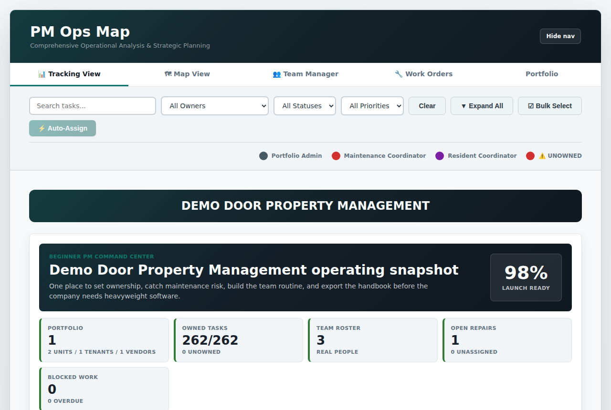
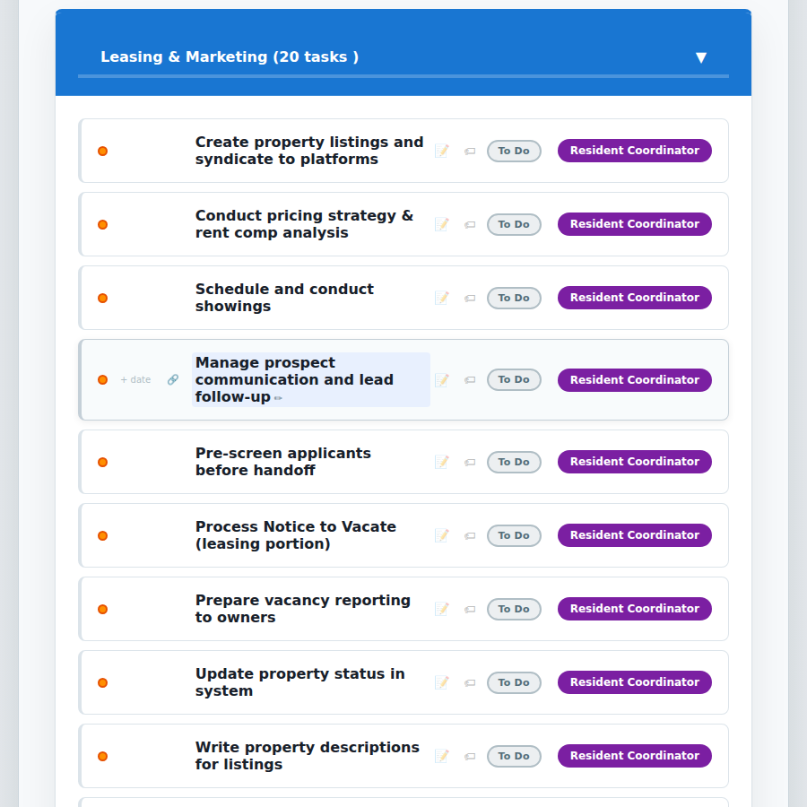
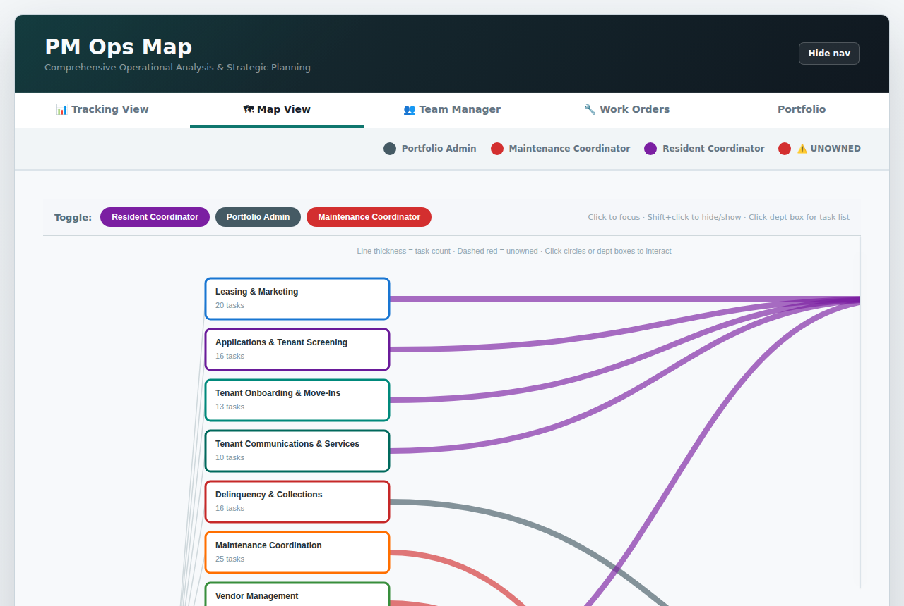
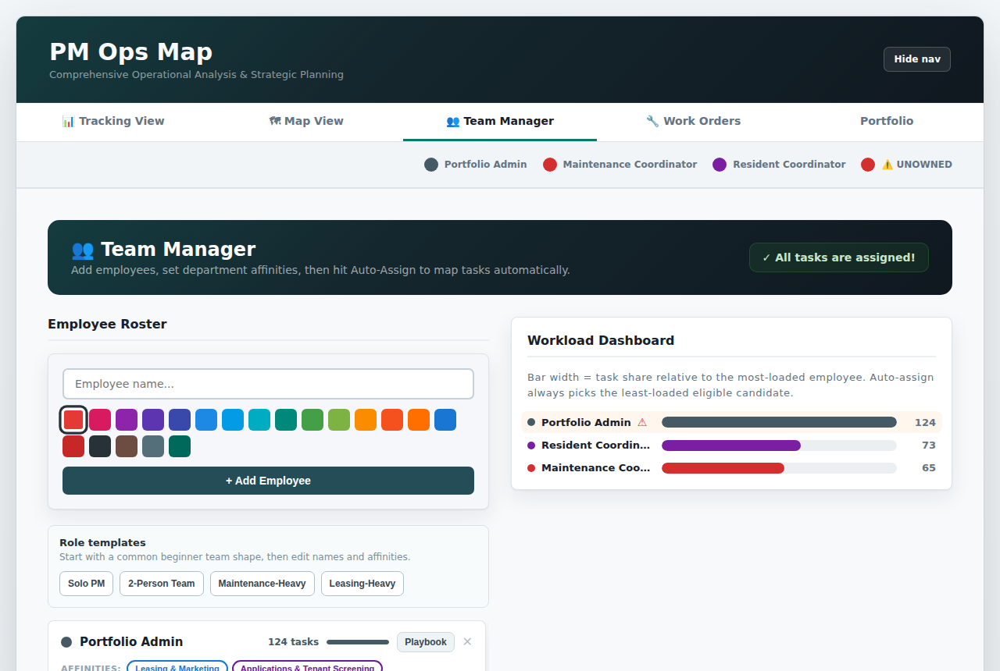
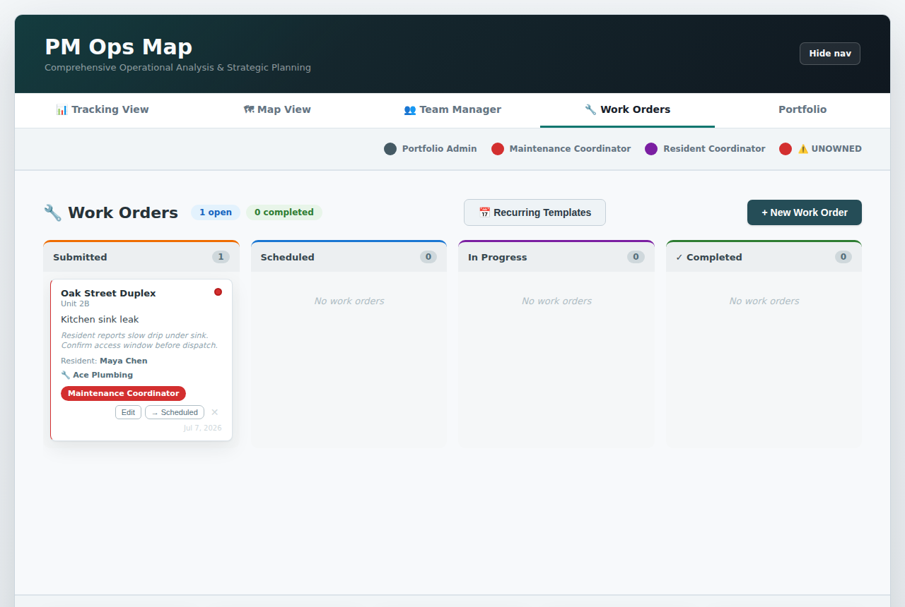
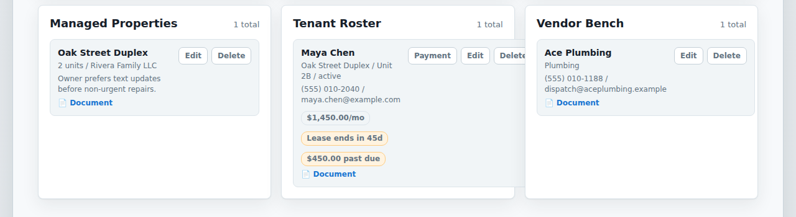

<div align="center">

# PM Ops Map

**Free, open-source operations management for property management companies.**
Track every department, every task, every maintenance request — and exactly who owns what.

[](LICENSE.txt)
[](https://github.com/hypnoticdata777/paragon-ops-map/releases/latest)
[](https://github.com/hypnoticdata777/paragon-ops-map/actions)

**No database required. No login required. No backend required. No monthly fee.**

<!-- TODO: replace with the portfolio URL once it's live -->
See it in action on [my portfolio](#) — or run it yourself in under a minute, see below.

</div>

---

## What Is It?

PM Ops Map is a free browser app that gives a property management company a complete operating system on day one — without signing up for anything.

Open it, enter your company name, and you get:

- **260+ standard PM tasks** across 17 departments, all editable to match your company
- **Team assignment engine** with auto-assign, workload balancing, and role templates
- **Maintenance work orders** tracked from intake to completion
- **Property, tenant, and vendor registry** with rent/lease tracking, delinquency alerts, document links, and CSV bulk import
- **Exportable operations handbook** (Markdown + printable HTML)
- **Recurring task templates** for weekly ops, monthly finance, compliance, and more
- **Auto-backups** so nothing gets lost
- **Optional team sync** — self-host a small sync server so your whole team shares one live workspace instead of one browser

Everything saves to `localStorage` by default. Nothing goes to a server unless you turn on Team Sync yourself. Export your data anytime as JSON or CSV.

---

## Get Started in 2 Minutes

### Option A — Live Demo (no setup)

<!-- TODO: replace with the portfolio URL once it's live -->
1. Open the live demo on [my portfolio](#)
2. Enter your company name and portfolio size
3. Add your team, assign tasks, track work orders

### Option B — Download the ZIP

1. Go to [Releases](https://github.com/hypnoticdata777/paragon-ops-map/releases/latest)
2. Download `pm-ops-map.zip` under **Assets**
3. Unzip → open `index.html` in any modern browser
4. Done

### Option C — Run Locally from Source

```bash
git clone https://github.com/hypnoticdata777/paragon-ops-map.git
cd paragon-ops-map
python -m http.server 8000
# open http://localhost:8000
```

Or with Node: `npm install && npm start`

### Option D — Fork and Host Free on GitHub Pages

1. Fork this repo
2. **Settings → Pages → Source → main branch**
3. Your team's URL is live at `https://yourusername.github.io/paragon-ops-map/`

---

## Who It's For

| Role | How they use it |
|------|----------------|
| **Operations Manager** | Audit ownership, spot gaps, run auto-assign to fill them |
| **CEO / Leadership** | See workload distribution and who is overloaded at a glance |
| **Department Leads** | Review responsibilities, track status, flag blockers |
| **Maintenance Coordinator** | Log work orders, assign vendors, advance jobs through the pipeline |
| **New Hires** | Understand their role and how it connects to the rest of the org |

---

## Screenshots

<table>
<tr>
<td width="50%">

**Guided dashboard on day one**


</td>
<td width="50%">

**Every task, owned and tracked**


</td>
</tr>
<tr>
<td width="50%">

**Org flow at a glance**


</td>
<td width="50%">

**Auto-assign and workload balancing**


</td>
</tr>
<tr>
<td width="50%">

**Maintenance pipeline**


</td>
<td width="50%">

**Rent, leases, and delinquency**


</td>
</tr>
</table>

---

## Features

### Task Tracking — The Core View

Every department as a collapsible card. Every task row shows priority, status, owner, and due date — all editable with a single click.

| Action | How |
|--------|-----|
| Rename a task | Double-click the task name → type → Enter |
| Reassign an owner | Click the owner badge → pick from dropdown |
| Change status | Click the status pill — cycles To Do → In Progress → Blocked → Done |
| Change priority | Click the colored dot — cycles High → Medium → Low |
| Set a due date | Click the calendar icon |
| Set a dependency | Click the dependency chip → search and select the blocking task |
| Add notes | Click 📝 — freeform notes saved per task |
| Add custom fields | Click 🏷️ — up to 10 key-value pairs per task (billing codes, unit refs, etc.) |
| Bulk edit | Enable bulk mode → check tasks → reassign or change status in one shot |

#### Filters

Search by keyword, owner, status, or priority — all four compose together. The search input debounces at 200ms so it doesn't stutter while you type. Clear all with one button.

---

### Bulk Select Mode

Enable **Bulk Mode** from the filter bar to check multiple tasks at once. A floating action bar appears at the bottom of the screen with dropdowns to reassign all selected tasks to a new owner or change all their statuses in one click. Works across collapsed departments too.

---

### Per-Task Notes

Click the **📝** icon on any task to open a notes panel. Freeform text, up to 1,000 characters, saved automatically to `localStorage`. The icon turns solid when a task has notes so nothing gets buried.

---

### Custom Task Fields

Click **🏷️** on any task to add your own key-value fields. Up to 10 per task. Good for things the default columns don't cover — billing codes, unit numbers, vendor reference IDs, permit numbers, inspection scores. Fields persist in `localStorage` alongside all other task data.

---

### Recurring Work Order Templates

Click **📅 Recurring Templates** in the Work Orders toolbar to pick from five built-in PM task templates:

| Template | Frequency |
|----------|-----------|
| Weekly Ops Check | Weekly |
| Monthly Financial Review | Monthly |
| Monthly Compliance Check | Monthly |
| Quarterly Property Inspections | Quarterly |
| Move Cycle (Move-In/Move-Out) | Per turn |

Pick a template, enter a property name and due date, and the app creates the matching work orders automatically. Every created work order is tagged with the template name in its notes.

---

### Auto-Backup Snapshots

The app automatically saves a snapshot before every import, every auto-assign run, and every Team Sync update. Click **Backups** in the stats bar to see the last 5 snapshots and restore any of them with one click.

Each backup captures: all tasks and their state, the full team roster, all work orders, and the portfolio registry.

---

### Team Manager — Auto-Assignment Engine

Add employees by name and badge color. Set **department affinities** on each card (click to toggle), then hit **⚡ Auto-Assign** to route every unowned task in one shot using two rules:

1. **Affinity match** — prefer employees tagged for that department
2. **Workload balance** — among matching employees, pick the one with the fewest tasks

No employee with no affinity for a department? The engine falls back to the globally least-loaded person. No task is ever left UNOWNED after a run.

**Employee name validation** — names are capped at 60 characters and "UNOWNED" is blocked as a name.

#### Role Templates

| Template | Best for |
|----------|----------|
| **Solo PM** | One operator covering every lane |
| **2-Person Team** | Splitting front-office and back-office |
| **Maintenance-Heavy** | Teams where repairs, vendors, and turns dominate |
| **Leasing-Heavy** | Teams focused on pipeline, applications, and move-ins |

#### Role Playbooks

Click **Playbook** on any employee card for a full scrollable summary — workload metrics, status breakdown, priority focus, blockers, active work orders, and the full responsibility list. Download as Markdown for onboarding packets.

---

### Work Orders — Maintenance Pipeline

Four-stage kanban: **Submitted → Scheduled → In Progress → Completed**

Each work order captures: property, unit, tenant/resident, issue title, notes, priority, assignee, vendor, target date, and estimated cost. Cards are fully editable after creation. A pulsing red beacon on the tab means at least one open work order has no assignee.

---

### Portfolio & Data Quality

Track properties, tenants, and vendors in the **Portfolio tab**. Tenant records include monthly rent and lease start/end dates, with a color-coded chip that flags leases renewing within 60 days or already expired — surfaced both on the tenant card and in the Launch Plan's risk queue.

**Rent collection.** Each tenant tracks a balance due. Click **Payment** on a tenant card to record what came in — it reduces the balance, stamps the payment date, and logs it to the audit trail. Any tenant with an outstanding balance shows a past-due chip (escalating to a stronger warning once they owe a full month's rent) and rolls up into a Launch Plan risk item showing total dollars outstanding across the portfolio.

**Document links.** Properties, tenants, and vendors can each carry a link to an external document — a signed lease, a certificate of insurance, a deed — pasted from wherever you already store files (Google Drive, Dropbox, etc.). No file upload or storage backend involved; only `http(s)://` links are accepted and validated both on save and on render.

The launch dashboard also runs four data-quality checks (missing owner, missing phone/email, open work orders without assignees) and feeds a readiness score before you export or hand off.

**Bulk import from CSV.** Already tracking properties, tenants, or vendors in a spreadsheet? Click **Import CSV** next to any of the three Portfolio forms to add them all at once instead of typing each one in — no need to change your existing sheet's column order, just the column names need to roughly match. Column headers match what **Export CSV** produces for that same record type, so exporting, editing in Excel/Sheets, and re-importing is a real round trip. Import always adds new records; it never edits or removes existing ones, and shows a summary of skipped/warned rows before anything is saved.

---

### Operations Handbook Export

One click generates a complete operations handbook from your current workspace:

- **Handbook .md** — full Markdown document (works in Notion, Confluence, or any editor)
- **Handbook .html** — self-contained printable HTML file, no extra tools needed
- **Print Handbook** — browser print dialog with clean formatting

The handbook includes: company profile, team roster, workload breakdown, full department SOP checklists, work order summary, and starter SOP templates (daily huddle, maintenance intake, owner reports, move-in handoffs).

---

### Map View — Org Flow Visualization

Custom SVG diagram: Company → Departments → Owners. Line thickness scales with task count. Click any owner circle to highlight their connections; click any department box to see its tasks in a slide-in panel. Hover for counts.

---

### Launch Plan — Guided First-Week Setup

Appears automatically for new companies. Uses your portfolio size and operating focus (stability / maintenance / growth / compliance) to recommend the next best action, surface setup gaps, and walk through a structured first-week checklist. Departments start collapsed so a brand-new company sees a short list of headers, not all 260+ tasks expanded at once — click any department to open it, or **Expand All** in the filter bar to see everything.

Click **"Show me an example first"** right on the onboarding screen (or **Load Demo Company** later from the dashboard) to explore a realistic sample workspace before entering real data.

---

### Audit Log

Every meaningful change (owner assignments, status and priority changes, task renames, auto-assign runs, work order advances and deletions, imports, paste-state operations, Team Sync connect/disconnect/sync events, rent payments recorded) is recorded in an append-only log. Capped at 500 entries. View or clear it from the stats bar.

---

### Multi-Device Sync

No backend needed — use **Copy State** and **Paste State** in the stats bar to move your full workspace between devices via clipboard. The import flow validates the schema, shows a preview report, and asks for confirmation before overwriting.

---

### Team Sync (optional, self-hosted)

For a team of more than one, Copy/Paste State is a manual chore. **Team Sync** in the stats bar connects this device to a small self-hosted sync server so your whole team shares one live workspace instead — no accounts, just a workspace name and a passphrase your team keeps between yourselves.

- The first device to connect to a workspace name creates it with its current data. Everyone else who connects with the same name and passphrase joins it.
- Changes sync automatically in the background every ~8 seconds. If your local edits and a teammate's collide, you get the same import-preview-and-confirm screen used for file imports before anything overwrites your device.
- Skip this entirely and the app works exactly as it always has, saved only to this browser.

The server lives in [`server/`](server/) — see [`server/README.md`](server/README.md) for how to run it locally, deploy it with Docker Compose for durable team use, or one-click deploy a free trial instance to Render.

---

### Overdue Notifications

Grant browser notification permission from the stats bar (**🔔 Alerts**). On each page load, the app checks for overdue tasks and sends one grouped notification per session if any are found.

---

## Customizing for Your Company

### Add or remove team members

Use **Team Manager** — no code required. Name + badge color + click **+ Add Employee**. Remove with ✕ (their tasks revert to UNOWNED).

### Customize departments and tasks

Edit `config.json` in the project root. No JavaScript needed.

```json
{
  "id": "leasing",
  "name": "Leasing & Marketing",
  "color": "#1976d2",
  "tasks": [
    { "name": "Follow up on expired listings", "owner": "UNOWNED" }
  ]
}
```

Add a new department the same way, using a new `id`.

### Fork and brand it

Change the company name on first launch (it's saved to `localStorage`). To re-run the setup, open DevTools → Application → localStorage → delete `pm-ops-company-name` and reload.

---

## Project Structure

```
pm-ops-map/
├── index.html              Main layout, navigation, all modals
├── config.json             Master data — departments, tasks, owners, colors, affinities
├── css/
│   └── style.css           All styles, responsive breakpoints, animations
├── js/
│   ├── app.js              Entry point — imports all modules, registers window globals
│   ├── state.js            Shared mutable state, constants, and setters
│   ├── storage.js          localStorage persistence, backup snapshots, toast notifications
│   ├── ui.js               Stats bar, beacons, onboarding modal, notifications
│   ├── io.js               JSON/CSV export-import, clipboard sync, undo stack
│   ├── sync.js             Optional team sync client (connect/push/pull/auto-sync loop)
│   ├── launchPlan.js       Guided setup plan, data-quality checks, demo company
│   ├── handbook.js         Markdown + HTML operations handbook generator
│   ├── stateSchema.js      Versioned JSON export/import schema and validation
│   ├── templates.js        Role templates, SOP templates, demo workspace data
│   ├── utils.js            Pure utility functions
│   ├── views/
│   │   ├── tracking.js     Tracking view, filters, bulk mode, notes, custom fields
│   │   ├── map.js          SVG flow map and department panel
│   │   ├── team.js         Team Manager, auto-assign engine, playbooks, audit log
│   │   ├── portfolio.js    Property, tenant, and vendor registry
│   │   ├── workorders.js   Work Orders kanban board
│   │   └── recurring.js    Recurring work order templates
│   └── __tests__/
│       ├── data.test.js    config.json structure tests
│       ├── utils.test.js   Utility function tests
│       ├── stateSchema.test.js
│       └── templates.test.js
├── server/                  Optional self-hosted sync server (own package.json, tests, Docker) — see server/README.md
├── docker-compose.yml       Runs the sync server locally with durable storage
├── render.yaml              One-click Render deploy for the sync server
├── .github/workflows/ci.yml  CI: install, test, audit, build (app + sync server as separate jobs)
├── CONTRIBUTING.md
├── LICENSE.txt
└── webpack.config.*.js       Optional build configs (not needed to run)
```

---

## Technology Stack

| Layer | Choice | Why |
|-------|--------|-----|
| Structure | HTML5 | No framework overhead |
| Styles | CSS3 (Flexbox, Grid) | Responsive without a CSS library |
| Logic | Vanilla JS ES Modules | Zero runtime dependencies |
| Visualization | Custom SVG | Full control over layout and interactivity |
| Persistence | localStorage | Survives page refresh, no backend |
| Build | Webpack 5 (optional) | Not required to run the app |

**Zero runtime dependencies.** Deploys as static files.

---

## Architecture

### Data flow

`config.json` is fetched on load. `app.js` stamps each task with a stable `_configName` identity key and passes the result to `state.js`. Every module imports from `state.js`. UI edits mutate in-memory objects; `storage.js` persists them to `localStorage` after each change. Nothing goes to a server unless `sync.js` is connected to a Team Sync workspace.

### Module graph (no circular dependencies)

```
utils.js            ← no dependencies
state.js            ← no dependencies
storage.js          ← state, utils
ui.js               ← state, storage, utils
views/tracking.js   ← state, storage, utils, ui
views/map.js        ← state, storage, utils
views/team.js       ← state, storage, utils, ui, views/tracking, views/map, views/workorders
views/portfolio.js  ← state, storage, utils, launchPlan
views/workorders.js ← state, storage, utils, ui
views/recurring.js  ← state, storage, views/workorders
launchPlan.js       ← state, storage, utils
handbook.js         ← state, storage, utils, templates
io.js               ← state, storage, utils, stateSchema, ui, views/*
sync.js             ← state, storage, utils, stateSchema, io
app.js              ← everything above
```

### Adding a new HTML-callable function

ES modules do not automatically place functions on `window`. Every `onclick="fn()"` handler must be imported in `app.js` and added to `Object.assign(window, { ... })` at the bottom. If you add a new function callable from HTML, add it there or it will silently fail.

---

## Development

```bash
npm install
npm start          # webpack-dev-server with live reload → localhost:8080
npm test           # Jest unit test suite
npm run build      # Production bundle → dist/
```

Requires Node.js 20.9+. The optional sync server has its own independent test suite — see [`server/README.md`](server/README.md).

CI runs two jobs on every push and pull request: the app (`npm ci` → `npm test` → `npm audit --omit=dev` → `npm run build`) and the sync server (`cd server && npm ci && npm test && npm audit --omit=dev`).

---

## Browser Compatibility

Chrome 80+, Firefox 74+, Safari 13.1+, Edge 80+. Mobile touch targets are optimized for phone/tablet use.

---

## Roadmap

This is an actively developed proof of concept, not a finished product — here's the honest state of things.

**Shipped:**
- Task ownership tracking across 17 departments with auto-assign and workload balancing
- Maintenance work order pipeline (intake → scheduled → in progress → completed)
- Property, tenant, and vendor registry with lease dates, rent, and delinquency tracking
- Document links (lease PDFs, COIs, W9s) via external URL — no file storage needed
- CSV bulk import/export for the whole portfolio
- Optional self-hosted Team Sync so more than one person can use this at once
- Operations handbook export, audit log, auto-backups, guided first-week setup

**Next up:**
- Real notifications (email/SMS) instead of same-session browser alerts
- Actual file uploads for documents, not just external links
- Exportable rent-roll and delinquency reports formatted for owners
- Field-level conflict resolution for Team Sync (right now a true conflict resolves as "take theirs or take mine," not a merge)

**Further out, not committed to:**
- A tenant-facing portal (payment status, maintenance requests)
- Real user accounts/roles instead of the shared-passphrase workspace model

If you're evaluating this for real use today: the core ownership/maintenance/portfolio workflow is solid and tested. Team Sync is genuinely useful for a small trusted team but intentionally skips enterprise auth. Treat it as what it is — a fast, honest way to see whether this kind of tool is worth building further for your company.

---

## Contributing

See [CONTRIBUTING.md](CONTRIBUTING.md). PRs welcome — especially department templates, mobile UX improvements, and visualization options.

---

## License

MIT — free to use, modify, and deploy. See [LICENSE.txt](LICENSE.txt).
